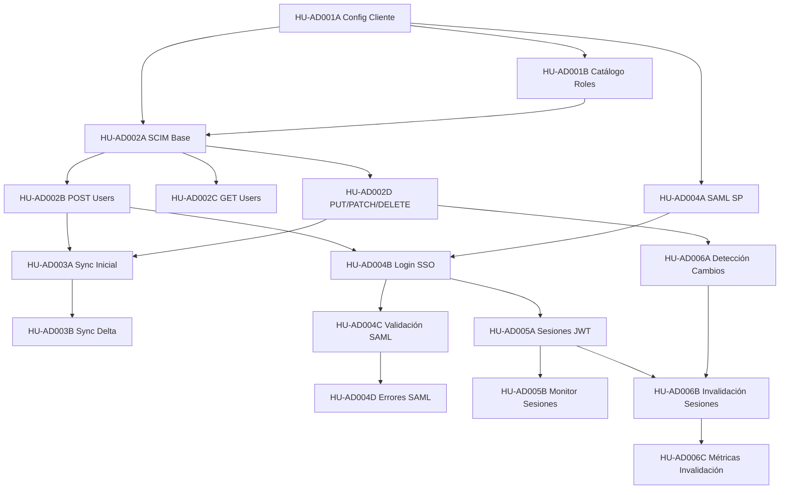

# Índice Maestro - Integración Active Directory mediante SCIM

## Información del Epic

| Campo | Valor |
|-------|-------|
| **Epic** | Integración con Active Directory mediante SCIM |
| **Release objetivo** | Release 2 |
| **Total HUs** | 27 |
| **Estado** | BORRADOR |
| **Última actualización** | 2026-01-20 |

---

## Visión General

Este epic implementa la integración completa entre el Portal de e-factura y Active Directory corporativo de clientes mediante:
- **SCIM 2.0** para sincronización unidireccional de usuarios (AD → Portal)
- **SAML 2.0** para autenticación SSO (obligatorio, no negociable)
- **Invalidación proactiva** de sesiones <1 minuto SLA
- **Arquitectura multitenant** con configuración independiente por cliente

---

## Módulos y Roadmap Sugerido

### **FASE 1: Fundamentos** (Prioridad ALTA - Requisito base)

#### Módulo 1: Configuración Base (2 HUs)
| ID | Historia de Usuario | Escenarios | Valor de Negocio | Riesgo Técnico |
|----|---------------------|------------|------------------|----------------|
| [HU-AD001A](HU-AD001A%20-%20Configuración%20de%20Cliente%20para%20Integración%20AD.md) | Configuración de Cliente para Integración AD | 15 | ⭐⭐⭐⭐⭐ | 🔴 Alto |
| [HU-AD001B](HU-AD001B%20-%20Catálogo%20de%20Roles%20y%20Mapeo.md) | Catálogo de Roles y Mapeo | 10 | ⭐⭐⭐⭐ | 🟡 Medio |

**Dependencias:** Ninguna (punto de partida)
**Entregable:** Admin puede configurar tenant con IdP y generar Bearer token

---

### **FASE 2: Sincronización de Usuarios** (Prioridad ALTA)

#### Módulo 2: SCIM Endpoint (4 HUs)
| ID | Historia de Usuario | Escenarios | Valor de Negocio | Riesgo Técnico |
|----|---------------------|------------|------------------|----------------|
| [HU-AD002A](HU-AD002A%20-%20Implementación%20Endpoint%20SCIM%20Base.md) | Implementación Endpoint SCIM Base | 13 | ⭐⭐⭐⭐⭐ | 🔴 Alto |
| [HU-AD002B](HU-AD002B%20-%20Operación%20POST%20Users%20(Crear%20Usuario).md) | Operación POST Users (Crear Usuario) | 15 | ⭐⭐⭐⭐⭐ | 🟡 Medio |
| [HU-AD002C](HU-AD002C%20-%20Operación%20GET%20Users%20(Consultar%20Usuarios).md) | Operación GET Users (Consultar Usuarios) | 12 | ⭐⭐⭐ | 🟢 Bajo |
| [HU-AD002D](HU-AD002D%20-%20Operaciones%20PUT%20PATCH%20DELETE%20Users.md) | Operaciones PUT PATCH DELETE Users | 15 | ⭐⭐⭐⭐ | 🟡 Medio |

**Dependencias:** HU-AD001A (config tenant), HU-AD001B (catálogo roles)
**Entregable:** Cliente AD puede sincronizar usuarios mediante SCIM 2.0

#### Módulo 3: Sincronización (2 HUs)
| ID | Historia de Usuario | Escenarios | Valor de Negocio | Riesgo Técnico |
|----|---------------------|------------|------------------|----------------|
| [HU-AD003A](HU-AD003A%20-%20Sincronización%20Inicial%20Masiva%20de%20Usuarios.md) | Sincronización Inicial Masiva de Usuarios | 12 | ⭐⭐⭐⭐⭐ | 🔴 Alto |
| [HU-AD003B](HU-AD003B%20-%20Sincronización%20Delta%20(Cambios%20Incrementales).md) | Sincronización Delta (Cambios Incrementales) | 10 | ⭐⭐⭐⭐ | 🟡 Medio |

**Dependencias:** Módulo 2 completo
**Entregable:** Sincronización masiva inicial + delta incremental automático

---

### **FASE 3: Autenticación SSO** (Prioridad ALTA - Requisito crítico)

#### Módulo 4: SAML Authentication (4 HUs)
| ID | Historia de Usuario | Escenarios | Valor de Negocio | Riesgo Técnico |
|----|---------------------|------------|------------------|----------------|
| [HU-AD004A](HU-AD004A%20-%20Implementación%20Service%20Provider%20SAML%202.0.md) | Implementación Service Provider SAML 2.0 | 10 | ⭐⭐⭐⭐⭐ | 🔴 Alto |
| [HU-AD004B](HU-AD004B%20-%20Flujo%20de%20Login%20SSO.md) | Flujo de Login SSO | 15 | ⭐⭐⭐⭐⭐ | 🔴 Alto |
| [HU-AD004C](HU-AD004C%20-%20Validación%20de%20Aserciones%20SAML.md) | Validación de Aserciones SAML | 15 | ⭐⭐⭐⭐⭐ | 🔴 Alto |
| [HU-AD004D](HU-AD004D%20-%20Manejo%20de%20Errores%20SAML.md) | Manejo de Errores SAML | 10 | ⭐⭐⭐⭐ | 🟡 Medio |

**Dependencias:** HU-AD001A (config IdP), HU-AD002B (usuarios sincronizados)
**Entregable:** Usuario se autentica mediante SSO SAML 2.0

---

### **FASE 4: Gestión de Sesiones** (Prioridad ALTA)

#### Módulo 5: Session Management (2 HUs)
| ID | Historia de Usuario | Escenarios | Valor de Negocio | Riesgo Técnico |
|----|---------------------|------------|------------------|----------------|
| [HU-AD005A](HU-AD005A%20-%20Gestión%20de%20Sesiones%20JWT.md) | Gestión de Sesiones JWT | 15 | ⭐⭐⭐⭐⭐ | 🟡 Medio |
| [HU-AD005B](HU-AD005B%20-%20Monitor%20de%20Actividad%20de%20Sesiones.md) | Monitor de Actividad de Sesiones | 10 | ⭐⭐⭐ | 🟢 Bajo |

**Dependencias:** HU-AD004B (login SSO)
**Entregable:** Sesiones JWT stateful con duración configurable

---

### **FASE 5: Invalidación Proactiva** (Prioridad ALTA - Requisito crítico)

#### Módulo 6: Proactive Invalidation (3 HUs)
| ID | Historia de Usuario | Escenarios | Valor de Negocio | Riesgo Técnico |
|----|---------------------|------------|------------------|----------------|
| [HU-AD006A](HU-AD006A%20-%20Detección%20de%20Cambios%20Críticos.md) | Detección de Cambios Críticos | 15 | ⭐⭐⭐⭐⭐ | 🔴 Alto |
| [HU-AD006B](HU-AD006B%20-%20Invalidación%20de%20Sesiones%20Activas.md) | Invalidación de Sesiones Activas | 13 | ⭐⭐⭐⭐⭐ | 🔴 Alto |
| [HU-AD006C](HU-AD006C%20-%20Métricas%20de%20Invalidación%20Proactiva.md) | Métricas de Invalidación Proactiva | 10 | ⭐⭐⭐⭐ | 🟡 Medio |

**Dependencias:** HU-AD005A (sesiones JWT), HU-AD002D (PATCH/DELETE users)
**Entregable:** Invalidación automática <1 minuto SLA desde cambio crítico

---

### **FASE 6: Auditoría y Observabilidad** (Prioridad MEDIA)

#### Módulo 7: Audit & Logs (4 HUs)
| ID | Historia de Usuario | Escenarios | Valor de Negocio | Riesgo Técnico |
|----|---------------------|------------|------------------|----------------|
| [HU-AD007A](HU-AD007A%20-%20Dashboard%20de%20Auditoría%20AD.md) | Dashboard de Auditoría AD | 7 | ⭐⭐⭐⭐ | 🟢 Bajo |
| [HU-AD007B](HU-AD007B%20-%20Logs%20Técnicos%20de%20SCIM.md) | Logs Técnicos de SCIM | 6 | ⭐⭐⭐ | 🟢 Bajo |
| [HU-AD007C](HU-AD007C%20-%20Alertas%20Automáticas.md) | Alertas Automáticas | 5 | ⭐⭐⭐⭐ | 🟡 Medio |
| [HU-AD007D](HU-AD007D%20-%20Retención%20y%20Archivado%20de%20Logs.md) | Retención y Archivado de Logs | 4 | ⭐⭐⭐ | 🟢 Bajo |

**Dependencias:** Todos los módulos anteriores (se auditan)
**Entregable:** Dashboard de auditoría + alertas automáticas + compliance

---

### **FASE 7: Resiliencia y Credenciales** (Prioridad MEDIA)

#### Módulo 8: Error Handling (2 HUs)
| ID | Historia de Usuario | Escenarios | Valor de Negocio | Riesgo Técnico |
|----|---------------------|------------|------------------|----------------|
| [HU-AD008A](HU-AD008A%20-%20Manejo%20de%20Errores%20SCIM.md) | Manejo de Errores SCIM | 7 | ⭐⭐⭐⭐ | 🟡 Medio |
| [HU-AD008B](HU-AD008B%20-%20Recovery%20y%20Resiliencia.md) | Recovery y Resiliencia | 6 | ⭐⭐⭐⭐ | 🔴 Alto |

**Dependencias:** Módulo 2 (SCIM endpoints)
**Entregable:** Errores estandarizados + retry automático + circuit breaker

#### Módulo 9: Credentials Management (2 HUs)
| ID | Historia de Usuario | Escenarios | Valor de Negocio | Riesgo Técnico |
|----|---------------------|------------|------------------|----------------|
| [HU-AD009A](HU-AD009A%20-%20Gestión%20de%20Bearer%20Tokens%20SCIM.md) | Gestión de Bearer Tokens SCIM | 6 | ⭐⭐⭐⭐ | 🟡 Medio |
| [HU-AD009B](HU-AD009B%20-%20Gestión%20de%20Certificados%20X.509.md) | Gestión de Certificados X.509 | 6 | ⭐⭐⭐⭐ | 🟡 Medio |

**Dependencias:** HU-AD001A (config tenant)
**Entregable:** Gestión segura de tokens + certificados con alertas de expiración

---

### **FASE 8: Seguridad y Compliance** (Prioridad ALTA - Pre-producción)

#### Módulo 10: Security (2 HUs)
| ID | Historia de Usuario | Escenarios | Valor de Negocio | Riesgo Técnico |
|----|---------------------|------------|------------------|----------------|
| [HU-AD010A](HU-AD010A%20-%20Seguridad%20y%20Pentesting.md) | Seguridad y Pentesting | 7 | ⭐⭐⭐⭐⭐ | 🔴 Alto |
| [HU-AD010B](HU-AD010B%20-%20Validación%20de%20Compliance.md) | Validación de Compliance | 7 | ⭐⭐⭐⭐⭐ | 🔴 Alto |

**Dependencias:** TODO el sistema implementado
**Entregable:** Pentesting externo + compliance GDPR/SOX/ISO 27001 validado

---

## Matriz de Dependencias

---

## Orden de Implementación Recomendado

### Sprint 1: Fundamentos (2 semanas)
1. HU-AD001A - Configuración de Cliente ⚠️ BLOQUEANTE
2. HU-AD001B - Catálogo de Roles
3. HU-AD002A - SCIM Base ⚠️ BLOQUEANTE

**Criterio de éxito:** Endpoint SCIM responde 401 con token inválido

### Sprint 2: Provisioning Básico (2 semanas)
4. HU-AD002B - POST Users ⚠️ BLOQUEANTE
5. HU-AD002C - GET Users
6. HU-AD003A - Sync Inicial

**Criterio de éxito:** Cliente puede sincronizar usuarios masivamente

### Sprint 3: Provisioning Completo (2 semanas)
7. HU-AD002D - PUT/PATCH/DELETE
8. HU-AD003B - Sync Delta
9. HU-AD008A - Manejo Errores SCIM

**Criterio de éxito:** Delta sync funcional cada 15 min

### Sprint 4: Autenticación SSO (3 semanas)
10. HU-AD004A - SAML SP ⚠️ BLOQUEANTE
11. HU-AD004B - Login SSO ⚠️ BLOQUEANTE
12. HU-AD004C - Validación SAML ⚠️ CRÍTICO SEGURIDAD
13. HU-AD004D - Errores SAML

**Criterio de éxito:** Usuario se autentica mediante SSO

### Sprint 5: Sesiones (2 semanas)
14. HU-AD005A - Sesiones JWT ⚠️ BLOQUEANTE
15. HU-AD005B - Monitor Sesiones
16. HU-AD009A - Bearer Tokens
17. HU-AD009B - Certificados X.509

**Criterio de éxito:** Sesión persiste y es configurable por tenant

### Sprint 6: Invalidación Proactiva (3 semanas)
18. HU-AD006A - Detección Cambios ⚠️ BLOQUEANTE
19. HU-AD006B - Invalidación Sesiones ⚠️ BLOQUEANTE
20. HU-AD006C - Métricas Invalidación

**Criterio de éxito:** SLA <60 segundos validado en QA

### Sprint 7: Observabilidad (2 semanas)
21. HU-AD007A - Dashboard Auditoría
22. HU-AD007B - Logs Técnicos
23. HU-AD007C - Alertas Automáticas
24. HU-AD007D - Retención Logs

**Criterio de éxito:** Admin puede auditar todas las operaciones

### Sprint 8: Resiliencia (1 semana)
25. HU-AD008B - Recovery y Resiliencia

**Criterio de éxito:** Sistema se recupera automáticamente de fallos

### Sprint 9: Pre-Producción (2 semanas)
26. HU-AD010A - Pentesting ⚠️ PRE-PRODUCCIÓN BLOQUEANTE
27. HU-AD010B - Compliance ⚠️ PRE-PRODUCCIÓN BLOQUEANTE

**Criterio de éxito:** Auditor externo aprueba seguridad y compliance

---

## Estimación Total

| Métrica | Valor |
|---------|-------|
| **Sprints totales** | 9 sprints (19 semanas ≈ 4.5 meses) |
| **Escenarios totales** | 276 escenarios |
| **HUs bloqueantes** | 9 HUs críticas path |
| **Riesgo alto** | 11 HUs con riesgo técnico alto |
| **Valor de negocio alto** | 18 HUs con valor ⭐⭐⭐⭐⭐ |

---

## Criterios de Aceptación del Epic

✅ **Funcionales:**
1. Cliente puede configurar integración AD completa desde UI admin
2. Usuarios se sincronizan automáticamente desde AD (inicial + delta)
3. Usuarios AD se autentican exclusivamente mediante SSO SAML 2.0
4. Cambios críticos invalidan sesiones en <60 segundos
5. Sistema soporta múltiples tenants con configuraciones independientes

✅ **No Funcionales:**
1. Rate limiting: 100 req/min por tenant
2. Uptime: 99.9% (excluye mantenimientos programados)
3. Auditoría completa de operaciones (retención 90 días mínimo)
4. Compliance con GDPR, SOX, ISO 27001, NIST
5. Pentesting externo aprobado sin findings CRITICAL/HIGH

✅ **Documentación:**
1. Guía de configuración para admins Portal
2. Guía de configuración para admins clientes (AD/SCIM/SAML)
3. Matriz de riesgos y plan de respuesta a incidentes
4. Documentación de APIs (Swagger/OpenAPI)

---

## Riesgos Identificados

| Riesgo | Probabilidad | Impacto | Mitigación |
|--------|--------------|---------|------------|
| Complejidad SAML 2.0 (primera vez) | 🔴 Alta | 🔴 Alto | Spike técnico sprint 0, consultor externo |
| Invalidación proactiva <60s SLA | 🟡 Media | 🔴 Alto | PoC workers + Redis antes de sprint 6 |
| Múltiples IdPs (Azure AD, Okta, Google) | 🟡 Media | 🟡 Medio | Testing con 3 IdPs principales en QA |
| Certificados expirados sin rotación | 🟢 Baja | 🔴 Alto | Alertas automáticas 30 días antes |
| Compliance requiere certificación ISO | 🟡 Media | 🔴 Alto | Consultar con legal/compliance antes sprint 9 |

---

## Notas Importantes

⚠️ **SAML es obligatorio (no negociable)**
- Password recovery tradicional se deshabilita para usuarios AD
- Cliente DEBE implementar SAML, no es opcional

⚠️ **AD es fuente de verdad**
- Sincronización es unidireccional (AD → Portal)
- Cambios en Portal se sobrescriben en próximo sync

⚠️ **Mapeo directo de roles**
- Cliente replica nombres exactos del catálogo Portal
- No hay mapeos custom ("Admin" → "Administrador del Portal")
- Case-sensitive

⚠️ **Invalidación proactiva es crítica**
- SLA <60 segundos no es negociable
- Requiere sesiones stateful (JWT en BD)

---

**Versión:** 1.0
**Última revisión:** 2026-01-20
**Autor:** Equipo Arquitectura Portal e-factura
